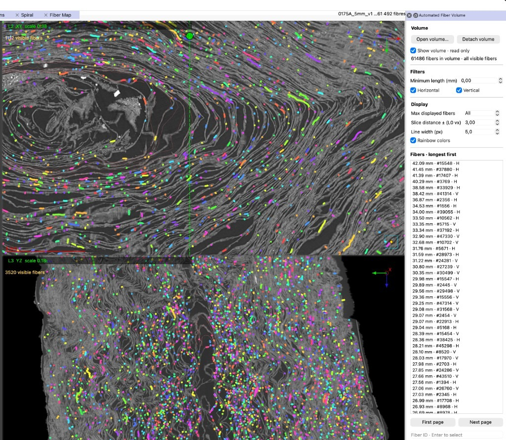

# Automated Fiber Volumes (.afv)

An **Automated Fiber Volume** is a single read-only SQLite file holding a large
fiber collection, such as the output of automated fiber tracing: exact geometry,
per-fiber annotations and a spatial index over blocks of geometry. It is written
outside VC3D, in the format described below. VC3D displays it next to the
editable annotations without importing it. Opening a volume reads its metadata
and one catalog page; each view then loads only the fibers crossing its visible
slice.



## Open

```sh
VC3D --volpkg scroll.volpkg.json --fiber-collection fibers.afv
```

or use **File → Open Automated Fiber Volume…**. The dock is under
**View → Fibers**.

## Viewer

* **Catalog.** Fibers are listed 200 per page, longest first, with lengths in
  millimeters and ties ordered by ID. In the main workspace, clicking a row
  selects the fiber and centers the views on its middle point. In Line
  Annotation, it opens the fiber's flattened view.
* **Filters.** **Minimum length (mm)** uses the complete stored polyline
  length (inclusive; 0 disables it). **Horizontal** and **Vertical** use the
  stored H/V classification; with both enabled, unclassified fibers are shown
  too. Filters apply to both the catalog and the overlay.
* **Display.** **Max displayed fibers** (default 1,000; 0 shows all) limits
  each viewport to that many fibers among those crossing its slice, chosen by
  stable per-fiber priorities; a visible selected fiber is always included.
  **Slice distance** is the half-thickness in native L0 voxels. Blue is H,
  orange V, grey unclassified and yellow the selection; **Rainbow colors**
  gives each fiber a stable color instead. Settings are remembered.
* **Selection.** A plain left click on a trace selects it and reveals it in the
  catalog; entering an ID does the same. Clicks used by collection points,
  fiber annotation, segmentation editing or line placement keep their native
  behavior, and drags are never treated as picks. The slider follows every
  stored point of the selected fiber.
* **Line Annotation.** **Open in Line Annotation** copies only the selected
  fiber into the project's editable annotations and fits it in both strips;
  opening it again reuses that copy. The `.afv` itself is never modified. If
  the project has no Lasagna dataset, the cuts follow a frame transported
  along the curve instead of measured sheet normals, and a notice says so.
  This frame is used for display only; tracing and optimization still require
  a dataset.
* **Limits.** The overlay is drawn on planar CT views, axis-aligned or oblique.
  Each viewport retains at most 8 MiB of visible geometry and shows
  **Partial fiber view** beyond that; zoom in or raise the minimum length.

## Coordinates

Coordinates are native L0 XYZ. VC3D opens a volume only if its `frame`
metadata names a `vc_open_data_coordinate_space` matching the coordinate
identity of the current CT volume, and uses that identity to display it on
volumes opened at another pyramid level. For a custom project, the volume entry
must carry the `vc-open-data-coordinate-space:<identity>` and
`vc-open-data-source-coordinate-level:<level>` tags and resolution metadata. A
missing or mismatching identity is reported in the dock.

## Project attachment

One volume can be attached per project. Its path (relative when possible) and
UUID are saved in `<project JSON>.fiber-collection.json`, or in
`fiber-collection.json` inside a volume package directory. It reopens with the
project without showing a hidden dock, and stays open when another volume of
the same coordinate space is selected. A file replaced by
one with a different UUID must be opened again explicitly. **Save Project As**
does not copy this attachment. **Detach volume** removes the reference, not the
data.

## Format version 1

A single SQLite database with RTree support, `PRAGMA application_id=0x56434643`
(`VCFC`) and `PRAGMA user_version=1`:

```sql
CREATE TABLE metadata(key TEXT PRIMARY KEY, value TEXT NOT NULL);
CREATE TABLE fibers(
  id INTEGER PRIMARY KEY, name TEXT NOT NULL, family TEXT NOT NULL,
  point_count INTEGER NOT NULL CHECK(point_count >= 2), length REAL NOT NULL,
  min_x REAL NOT NULL, max_x REAL NOT NULL, min_y REAL NOT NULL, max_y REAL NOT NULL,
  min_z REAL NOT NULL, max_z REAL NOT NULL, annotation TEXT NOT NULL);
CREATE INDEX fibers_length ON fibers(length DESC, id);
CREATE TABLE blocks(
  id INTEGER PRIMARY KEY, fiber_id INTEGER NOT NULL REFERENCES fibers(id),
  first_segment INTEGER NOT NULL, points BLOB NOT NULL,
  UNIQUE(fiber_id, first_segment));
CREATE VIRTUAL TABLE block_bounds USING rtree(id, min_x, max_x, min_y, max_y, min_z, max_z);
```

`metadata` values are JSON:

| Key | Value |
| --- | --- |
| `complete` | `true` once the file is fully written; other files are refused |
| `uuid` | a string identifying this file |
| `frame` | an object with `vc_open_data_coordinate_space`, and optionally `vc_open_data_source_coordinate_level` (must be 0) and `vc_open_data_source_coordinate_scale_factor` (must be 1) |
| `root` | an object with collection-level fields |
| `fiber_count`, `point_count` | integers |

The `coordinate_base_shape_zyx` and `vc_open_data_*` fields of `frame` and
`root` are copied into fibers opened in Line Annotation. Either object may
declare them; when both do, the values must match.

* **fibers** has one row per fiber. `family` is `H`, `V` or empty. `length` is
  the complete polyline length in native L0 voxels, and the bounds cover all
  its points. `annotation` is the fiber as a VC3D fiber annotation object
  (`"type": "vc3d_fiber"`) without `line_points`; **Open in Line Annotation**
  adds the geometry to it. The `fibers_length` index keeps the length-sorted
  catalog fast.
* **blocks** stores the geometry as little-endian binary64 XYZ triples, in
  point order. A block holds 2 to 257 points (at most 256 segments) starting
  at segment `first_segment`, and shares its last point with the next block of
  the same fiber, so a segment is identified by
  `(uuid, fiber ID, first_segment + local index)`.
* **block_bounds** holds the bounds of each block under its block ID.

Coordinates must be finite. VC3D reads them exactly as stored and never
simplifies them. The file is opened read-only and must not be modified while
attached.

## Reader

`vc/core/types/FiberCollection.hpp` (CMake target `vc_fiber_collection`, which
depends only on SQLite) provides the metadata, fiber summaries, the
length-sorted catalog, view queries, ordered fiber blocks, point lookup and
annotations. Each instance owns one read-only connection and must be used by
one thread at a time.

A view query takes candidate blocks from the RTree, then clips every segment
exactly against the slice prism, so crossings without a vertex inside the slice
are kept. Only the visible runs of segments are returned, with their original
coordinates and indices. VC3D gives each view a 32 MiB cache of block bounds
and decoded blocks; cached data never replaces the exact clipping, and a
cancelled query never populates the cache.

## Build and test

SQLite development headers with RTree support are required: `libsqlite3-dev`
on Debian/Ubuntu, `sqlite` on Homebrew, `sqlite3[rtree]` with vcpkg. With
`-DVC_TESTING=ON`:

```sh
cmake --build build --target VC3D test_fiber_collection
ctest --test-dir build -R test_fiber_collection --output-on-failure
```

The test writes its own `.afv` files in the format above.
